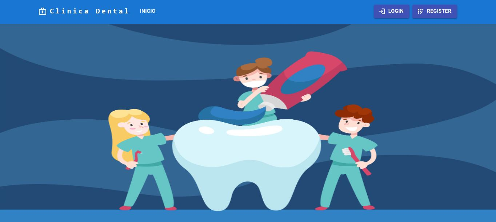
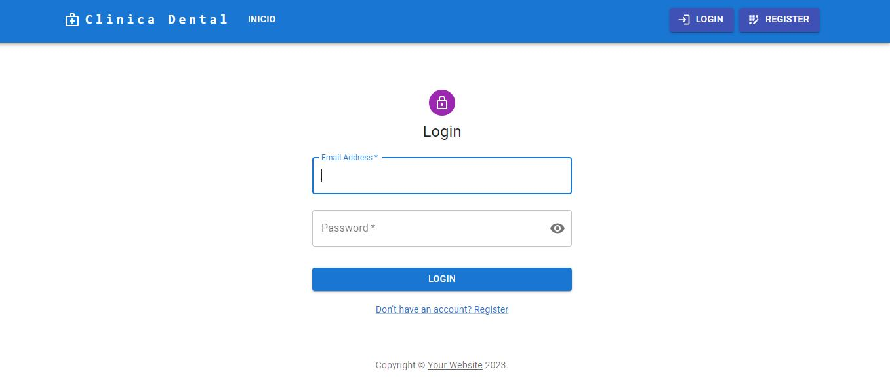
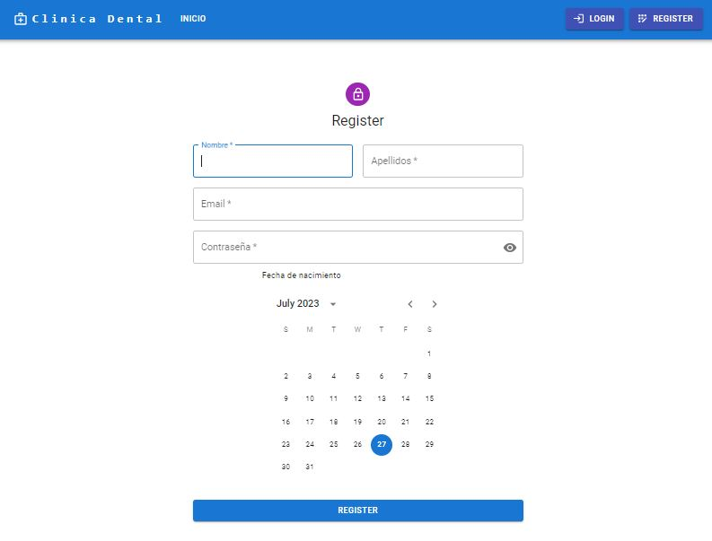
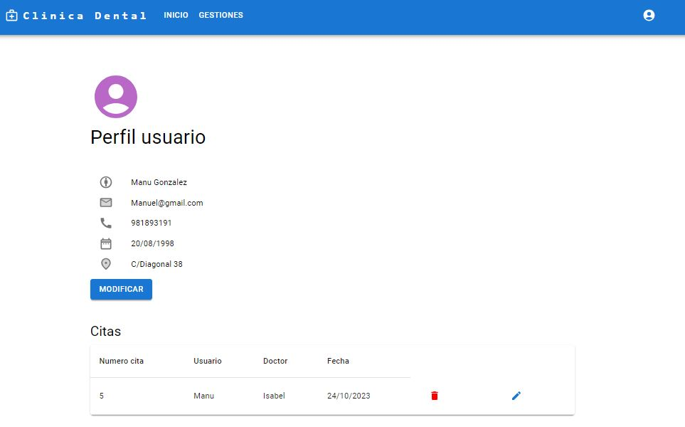
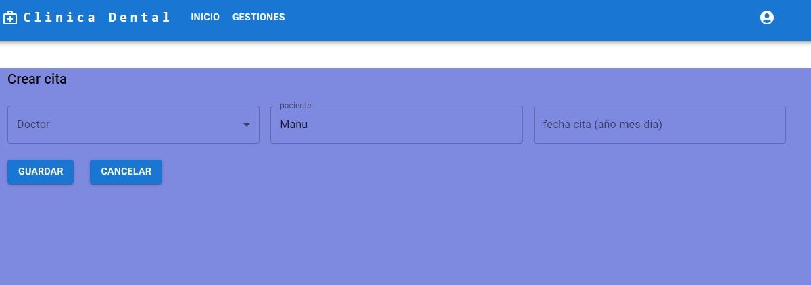
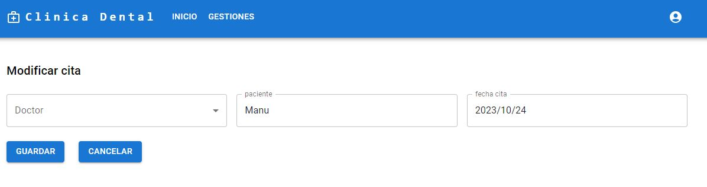
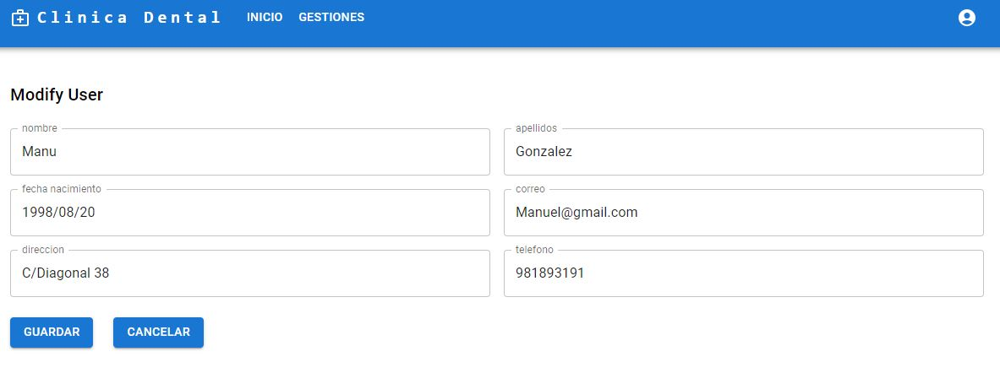
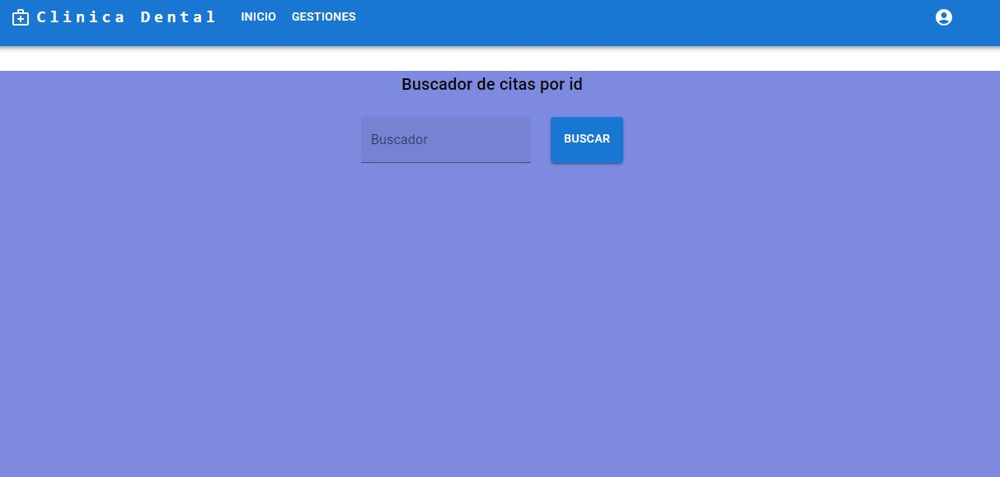
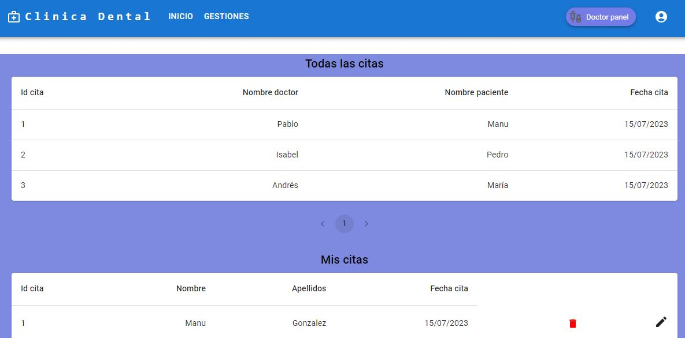
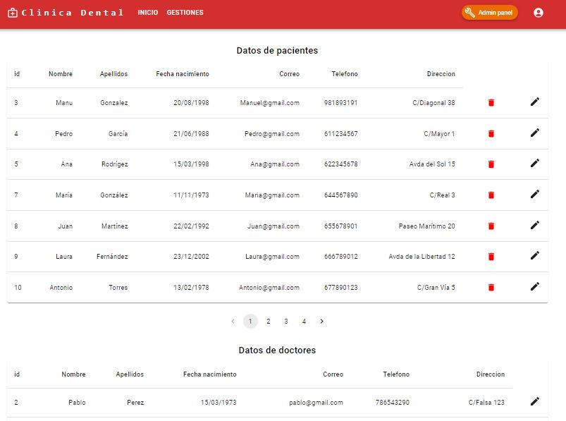

# Aplicación Backend para gestión de una clinica dental

  
Contenido 📝

  <ol>
    <li><a href="#objetivo">Objetivo</a></li>
    <li><a href="#sobre-el-proyecto">Sobre el proyecto</a></li>
    <li><a href="#deploy-🚀">Deploy</a></li>
    <li><a href="#stack">Stack</a></li>
    <li><a href="#diagrama-bd">Diagrama</a></li>
    <li><a href="#instalación-en-local">Instalación</a></li>
    <li><a href="#endpoints">Endpoints</a></li>
    <li><a href="#contacto">Contacto</a></li>
  </ol>

## Objetivo

Este proyecto requería una API funcional conectada a una base de datos, a traves de esa conexion deve mostrar esas peticiones en React.

## Sobre el proyecto

Aplicación de ejemplo para la gestión de una web de una clínica dental. La gestión se realiza teniendo en cuenta los distintos tipos de roles (admin, user, doctor) y mediante los End-Point enlazados.

## Deploy 🚀

    <a href="https://zackfer90.github.io/clinicaDentalFronted/"><strong>Url a producción </strong></a>🚀🚀🚀

## Stack

Tecnologías utilizadas:

 

## Imagenes Api

Inicio

Login

Registro

Perfil

Crear cita

Modificar cita

Modificar perfil

Buscar cita

Doctores visualizar citas

Admin visualizar usuarios

## Instalación en local

1. Clonar el repositorio
2. `$ npm install`
3. Conectamos nuestro repositorio con la base de datos
4. `$ npm run dev`

## Usuarios

- Paciente

        "email": "Manuel@gmail.com",
        "contrasena": "67890"

- Doctor

        "email": "pablo@gmail.com",
        "contrasena": "12345"

- Admin

        "email": "admin@gmail.com",
        "contrasena": "12345"

## Contacto

